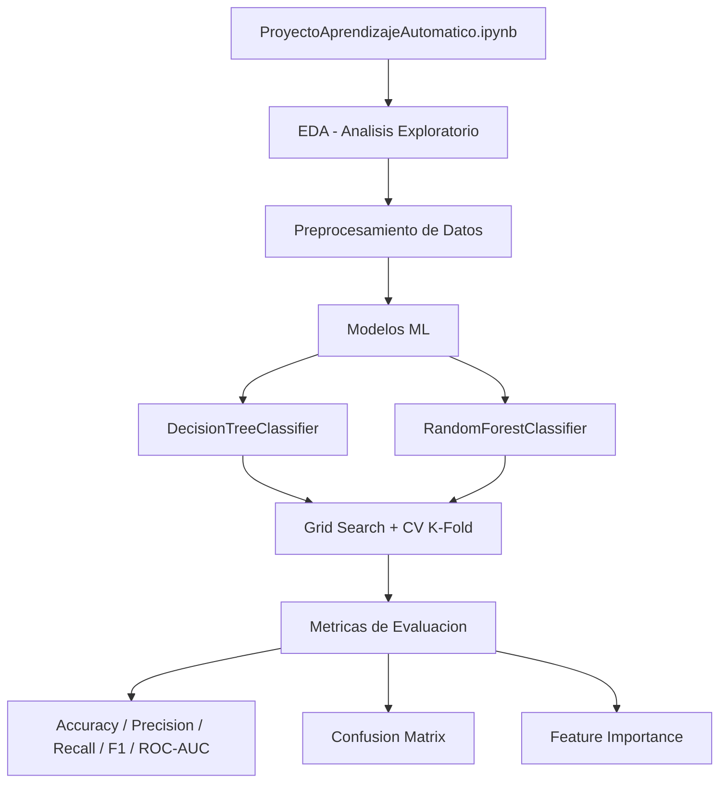

<div align="center">

# Árboles de Decisión y Random Forest — Aprendizaje Automático


> Clasificación y regresión con Decision Tree y Random Forest: grid search, validación cruzada y análisis de feature importance.

## Descripción

</div>

---

Implementación de modelos de **árbol de decisión (Decision Tree)** y **bosque aleatorio (Random Forest)** para tareas de clasificación y regresión en Python/Jupyter con scikit-learn. El proyecto incluye análisis exploratorio de datos, preprocesamiento, optimización de hiperparámetros con Grid Search, validación cruzada K-Fold y análisis de importancia de variables.

## Pipeline de ML

```python
from sklearn.tree import DecisionTreeClassifier
from sklearn.ensemble import RandomForestClassifier
from sklearn.model_selection import GridSearchCV, cross_val_score

# Grid Search para hiperparámetros
param_grid = {"max_depth": [3,5,10,None], "n_estimators": [50,100,200]}
gs = GridSearchCV(RandomForestClassifier(), param_grid, cv=5, scoring="f1")
gs.fit(X_train, y_train)
```

## Arquitectura



## Contenido del repositorio

| Archivo | Descripción |
|---|---|
| `ProyectoAprendizajeAutomático.ipynb` | Notebook principal con todo el pipeline |
| `*.pdf` | Informe con resultados y análisis |

## Métricas evaluadas

Accuracy · Precision · Recall · F1-Score · ROC-AUC · Confusion Matrix

## Contexto académico

**Asignatura:** Aprendizaje Automático · **Institución:** UNIR · Ingeniería Informática
**Autor:** Alejandro De Mendoza — Ingeniero Informático · Especialista en IA

---

## Autor

**Alejandro De Mendoza**  
Ingeniero Informático · Especialista en IA · Especialista en Ingeniería de Software · Máster en Arquitectura de Software

[](https://github.com/AlejoTechEngineer)
